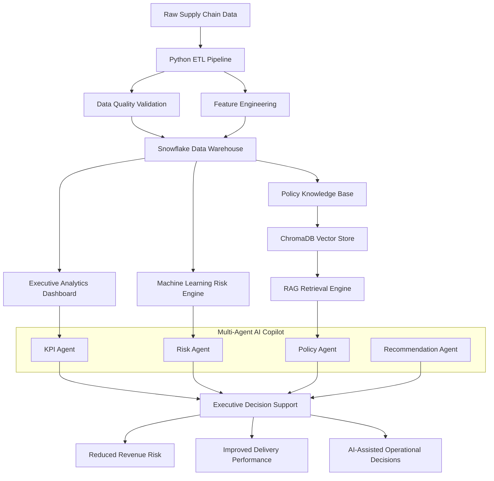

#  OpsPilot AI

## 🌐 Live Demo

**Application:** https://opspilot-supply-chain-ai.streamlit.app/

Experience the deployed Supply Chain Intelligence Platform featuring executive analytics dashboards, machine learning–driven delay prediction, policy-aware retrieval, and multi-agent decision intelligence.

## AI-Powered Supply Chain Intelligence Platform

OpsPilot AI is an end-to-end Supply Chain Intelligence Platform designed to help operations leaders identify delivery risks, quantify revenue exposure, and make faster data-driven decisions.

The platform combines Data Engineering, Business Intelligence, Machine Learning, Retrieval-Augmented Generation (RAG), and Multi-Agent AI into a unified decision-support system.

---

## Business Problem

Operations teams often struggle to answer critical business questions:

- Which delayed shipments are putting revenue at risk?
- Which regions are underperforming?
- What operational bottlenecks require immediate attention?
- Are teams following supply chain policies?
- What actions should leadership prioritize?

The information required to answer these questions is often scattered across spreadsheets, reports, dashboards, and policy documents.

OpsPilot AI centralizes operational intelligence into a single platform.

---

## Solution

OpsPilot AI provides:

### Data Intelligence Layer
- Automated ETL pipeline
- Data quality validation
- Feature engineering
- Snowflake data warehouse

### Analytics Layer
- Executive KPI dashboard
- Revenue monitoring
- Profitability analysis
- Customer and order analytics

### Predictive Intelligence Layer
- Delay prediction model
- Revenue-at-risk analysis
- Shipment risk monitoring

### AI Intelligence Layer
- Context-aware business copilot
- Policy-aware retrieval using ChromaDB
- Retrieval-Augmented Generation (RAG)
- Multi-Agent decision framework

---

## Architecture

## Platform Preview

### Executive Dashboard

### KPI Analytics

### Snowflake Data Warehouse

### RAG Policy Retrieval

### Multi-Agent Copilot

---

## Key Features

### Executive Dashboard
- Revenue tracking
- Profit monitoring
- Customer analytics
- Regional performance analysis

### Machine Learning
- Shipment delay prediction
- Revenue risk analysis
- Operational performance monitoring

### RAG System
- Policy document retrieval
- Semantic search
- Context-aware recommendations

### Multi-Agent AI
- KPI Agent
- Risk Agent
- Policy Agent
- Recommendation Agent

---

## Technology Stack

### Data Engineering
- Python
- Pandas
- Snowflake

### Analytics
- Streamlit
- Plotly

### Machine Learning
- Scikit-learn
- Random Forest

### AI & RAG
- ChromaDB
- Sentence Transformers
- Multi-Agent Architecture

---

## Business Impact

OpsPilot AI addresses a critical operational challenge: supply chain intelligence is often fragmented across spreadsheets, reports, dashboards, and policy documents, making it difficult for leaders to identify risks and act quickly.

The platform consolidates operational analytics, predictive intelligence, and business policies into a unified decision-support system that enables:

* Early identification of delayed shipments and operational bottlenecks
* Quantification of revenue-at-risk associated with delivery disruptions
* Proactive prioritization of high-risk customer orders
* Faster operational escalation through policy-aware recommendations
* Improved decision-making using analytics, machine learning, and AI-assisted insights

By combining Snowflake, machine learning, retrieval-augmented generation (RAG), and multi-agent AI, OpsPilot AI transforms raw operational data into actionable business intelligence.

---

## Project Highlights

- Built end-to-end analytics architecture
- Designed Snowflake data warehouse
- Developed machine learning risk models
- Implemented RAG-based policy retrieval
- Created multi-agent AI decision framework
- Delivered executive-ready business intelligence dashboards

## Conclusion

OpsPilot AI demonstrates how modern data engineering, analytics, machine learning, retrieval-augmented generation (RAG), and agentic AI can be integrated into a single operational intelligence platform.

The project showcases the complete lifecycle of a data product—from data ingestion and warehousing to predictive analytics, semantic retrieval, AI orchestration, and executive decision support—reflecting real-world challenges faced by supply chain and operations teams.

Built with the mindset of solving business problems, not just building models.