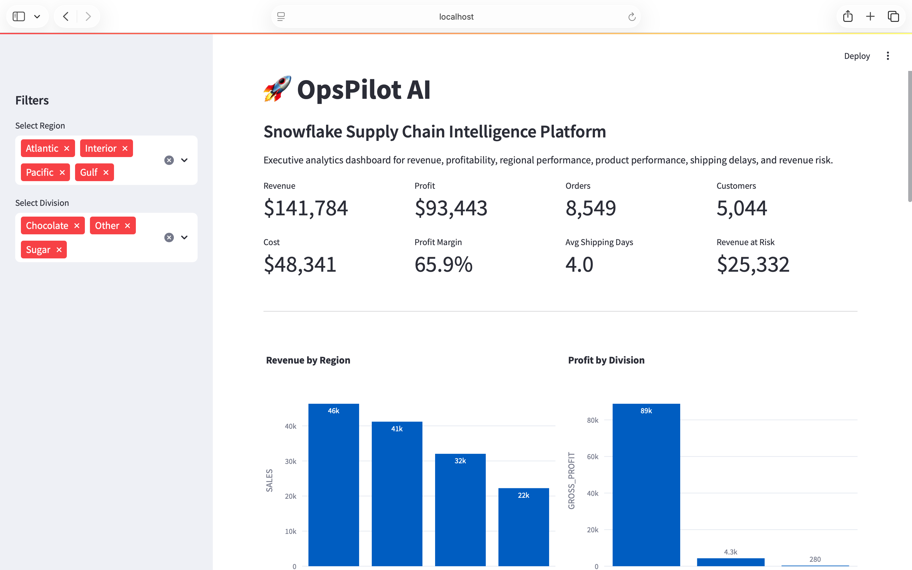
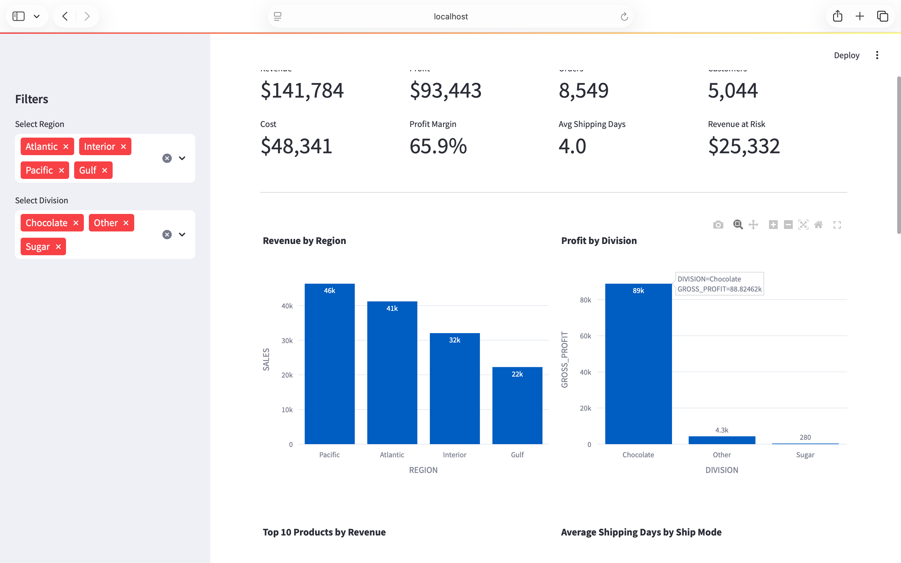
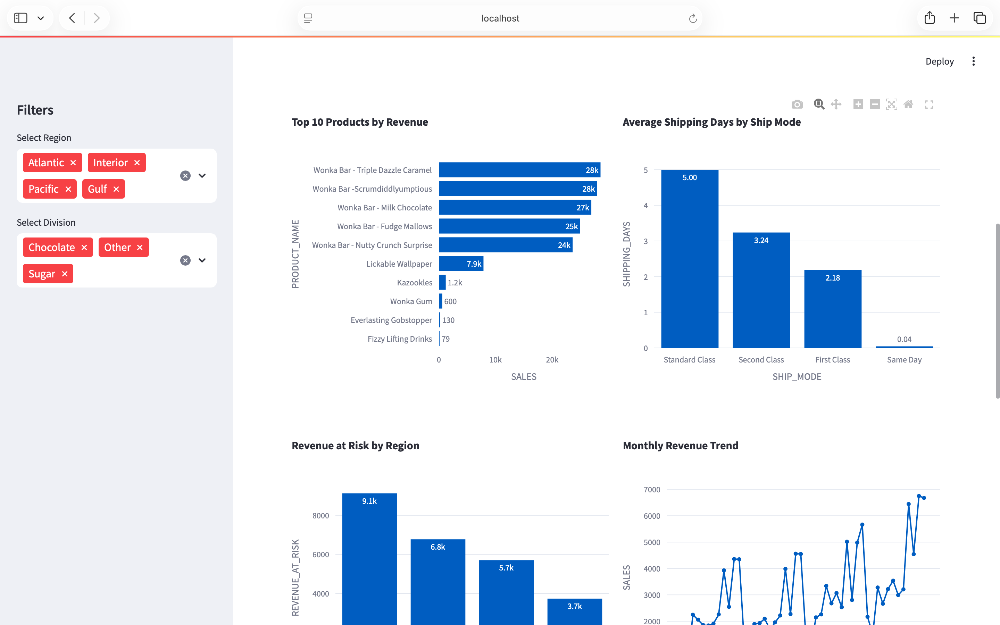
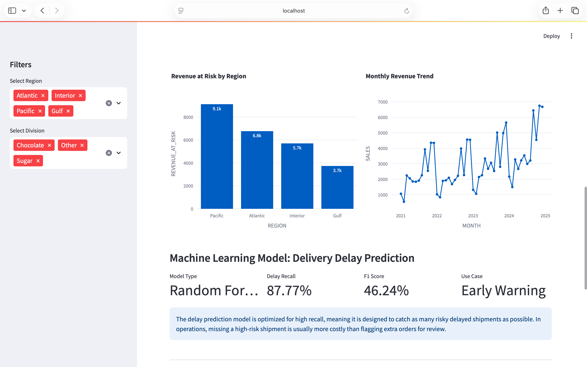
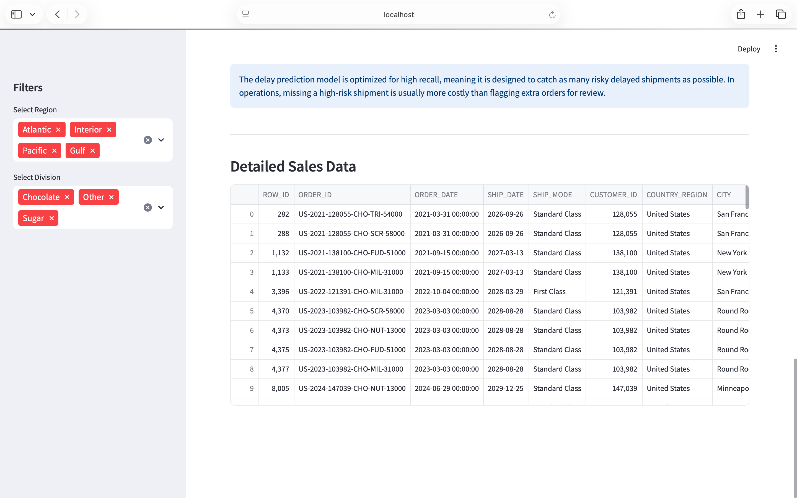

#  OpsPilot AI

## 🌐 Live Demo

**Application:** https://opspilot-supply-chain-ai.streamlit.app/

Experience the deployed Supply Chain Intelligence Platform featuring executive analytics dashboards, machine learning–driven delay prediction, policy-aware retrieval, and multi-agent decision intelligence.

## AI-Powered Supply Chain Intelligence Platform

OpsPilot AI is an end-to-end Supply Chain Intelligence Platform designed to help operations leaders identify delivery risks, quantify revenue exposure, and make faster data-driven decisions.

The platform combines Data Engineering, Business Intelligence, Machine Learning, Retrieval-Augmented Generation (RAG), and Multi-Agent AI into a unified decision-support system.

---

## Business Problem

Operations teams often struggle to answer critical business questions:

- Which delayed shipments are putting revenue at risk?
- Which regions are underperforming?
- What operational bottlenecks require immediate attention?
- Are teams following supply chain policies?
- What actions should leadership prioritize?

The information required to answer these questions is often scattered across spreadsheets, reports, dashboards, and policy documents.

OpsPilot AI centralizes operational intelligence into a single platform.

---

## Solution

OpsPilot AI provides:

### Data Intelligence Layer
- Automated ETL pipeline
- Data quality validation
- Feature engineering
- Snowflake data warehouse

### Analytics Layer
- Executive KPI dashboard
- Revenue monitoring
- Profitability analysis
- Customer and order analytics

### Predictive Intelligence Layer
- Delay prediction model
- Revenue-at-risk analysis
- Shipment risk monitoring

### AI Intelligence Layer
- Context-aware business copilot
- Policy-aware retrieval using ChromaDB
- Retrieval-Augmented Generation (RAG)
- Multi-Agent decision framework

---
## Platform Preview

### Executive Dashboard

### KPI Analytics

### Snowflake Data Warehouse

### RAG Policy Retrieval

### Multi-Agent Copilot

## Architecture

flowchart TD

                Raw Data
                     │
                ETL Pipeline
                /         \
       Data Quality    Feature Eng.
                \         /
                 Snowflake
          /         |         \
 Dashboard     ML Engine    Policies
                    |           |
                    |       ChromaDB
                    |           |
                    └──── RAG ──┘
                           |
                  Multi-Agent AI
                /    |    |    \
             KPI  Risk Policy Reco
                    |
          Executive Decisions
            /      |       \
      Revenue  Efficiency  Speed

---

## Key Features

### Executive Dashboard
- Revenue tracking
- Profit monitoring
- Customer analytics
- Regional performance analysis

### Machine Learning
- Shipment delay prediction
- Revenue risk analysis
- Operational performance monitoring

### RAG System
- Policy document retrieval
- Semantic search
- Context-aware recommendations

### Multi-Agent AI
- KPI Agent
- Risk Agent
- Policy Agent
- Recommendation Agent

---

## Technology Stack

### Data Engineering
- Python
- Pandas
- Snowflake

### Analytics
- Streamlit
- Plotly

### Machine Learning
- Scikit-learn
- Random Forest

### AI & RAG
- ChromaDB
- Sentence Transformers
- Multi-Agent Architecture

---

## Business Impact

OpsPilot AI helps organizations:

- Detect operational bottlenecks earlier
- Quantify revenue exposure
- Prioritize high-risk shipments
- Improve decision-making speed
- Centralize business intelligence
- Reduce manual operational analysis

---

## Project Highlights

- Built end-to-end analytics architecture
- Designed Snowflake data warehouse
- Developed machine learning risk models
- Implemented RAG-based policy retrieval
- Created multi-agent AI decision framework
- Delivered executive-ready business intelligence dashboards